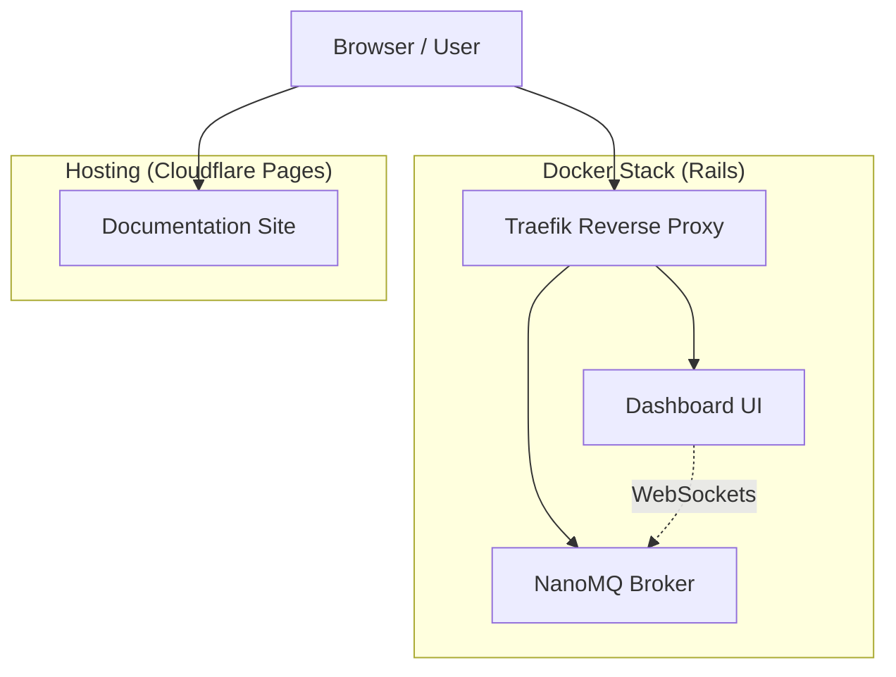

# IoT Modellbahn Project

Project documentation and management for the iot49 modellbahn repository.

## Documentation

The full project documentation, including installation guides, development workflows, and architectural overviews, is available at:

👉 **[rails49.org](https://rails49.org)**

## System Architecture



## Quick Links

- [Rails Installation](https://rails49.org/code/rails/installation/)
- [Rails Development](https://rails49.org/code/rails/development/)
- [API Reference](https://rails49.org/code/rails/api/)

## Development

To run the documentation locally:

```bash
cd doc
uv run mkdocs serve
```